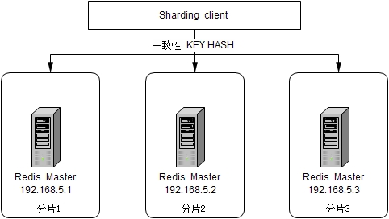

# 针对电商分布式系统的基础架构实现

# 环境搭建
## 整体架构

## Mysql集群

## Redis集群
  
通过客户端分片方式实现负载均衡，同时通过VIP+Master-Slave Sync方式实现服务端高可用。

## RabbitMQ集群

## Zookeeper集群

## config-toolkit
具体配置服务部署参考config-toolkit的<a href="https://github.com/dangdangdotcom/config-toolkit">github</a>

## 分布式环境各场景采用方案
### 分布式事务
关于分布式环境下的各个服务的事务均采用Spring事务管理器实现本地事务，而分布式服务之间的事务采用MQ消息实现最终一致的全局事务。

### 分布式Session
分布式环境下的Session采用独立的Redis集群进行管理。

### 分布式ID
设计单独的分布式ID获取服务，该服务通过Redis集群的incr获取自增id保证原子操作（为防止宕机数据丢失造成id重复，可尝试将时间数相加从而避免重复）。

### 分布式锁
设计单独的分布式锁服务，该服务通过Redis集群的setnx实现分布式并发锁操作。